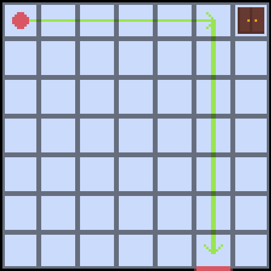

# APS - Lógica da Computação

**Desenvolvedor**: Carlos Eduardo Porciuncula Yamada

## Descrição

O seguinte projeto foi desenvolvido para a disciplina de Lógica da Computação do curso de Engenharia da Computação no Insper - 25.1.

A linguagem desenvolvida nesse projeto é uma representação em código das instruções que o usuário precisa fornecer para escapar de uma sala no estilo *Escape Room*. Para testes, uma sala predefinida será utilizada e os *outputs* se darão com base no algoritmo a ser computado.

## EBNF

```ebnf
PROGRAM = "enter", "\n", { STATEMENT }, "end", [ "\n" ];

STATEMENT = ( λ | MOVEMENT_BLOCK | INTERACT_BLOCK | SEQUENCE_BLOCK | CONDITIONAL_BLOCK | LOOP_BLOCK | ASSIGNMENT_BLOCK | COLLECT_COMMAND ), "\n";

ASSIGNMENT_BLOCK = IDENTIFIER, "=", INTERACT_BLOCK;

MOVEMENT_BLOCK = "move", DIRECTION, VALUE;

INTERACT_BLOCK = "interact", ( "open" | "collect" ), DIRECTION;

SEQUENCE_BLOCK = "define", "sequence", IDENTIFIER, ":", "\n", { STATEMENT }, "sequence", "end";

CONDITIONAL_BLOCK = "if", IF_CONDITION, ":", "\n", { STATEMENT }, "else", ":", "\n", { STATEMENT }, "conditional", "end";

IF_CONDITION = ( COLLECTABLE_CONDITION | OBJECT_CONDITION );

COLLECTABLE_CONDITION = IDENTIFIER, RELATIONAL_OPERATOR, VALUE;

OBJECT_CONDITION = "object", DIRECTION, RELATIONAL_BOOL, OBJECT_CONDITION_END;

OBJECT_CONDITION_END = ( INTERACTABLE | STATE );

LOOP_BLOCK = "while", LOOP_CONDITION, ":", "\n", { STATEMENT }, "loop", "end";

LOOP_CONDITION = ( COLLECTABLE_CONDITION | OBJECT_CONDITION );

COLLECT_COMMAND = "collect", COLLECTABLE, VALUE;

RELATIONAL_BOOL = ( "is" | "is not" );

RELATIONAL_OPERATOR = ( ">" | "<" | ">=" | "<=" | "==" | "!=" );

IDENTIFIER = LETTER, { LETTER | DIGIT | "_" };

VALUE = DIGIT, { DIGIT };

DIRECTION = ( "up" | "right" | "down" | "left" );

COLLECTABLE = ( "key" | "coins" | "card" );

INTERACTABLE = ( "locker" | "closet" | "desk" | "exit_door" );

STATE = ( "locked" | "unlocked" );

LETTER = ( a | ... | z | A | ... | Z );

DIGIT = ( 0 | 1 | 2 | 3 | 4 | 5 | 6 | 7 | 8 | 9 );
```

## Exemplos

Imaginando uma sala que possua o seguinte desenho:



Temos dois exemplos dos possíveis programas:

### Exemplo 1

#### Programa

```
enter
move right 5

if object right is closet:
    chave = interact collect right

move down 6
if object down is exit_door:
    interact open down

end
```

#### Saída

```
Entrou na sala...
Movimentou-se para a direita em 5 unidade(s)

Interagiu com o armário e coletou uma chave

Movimentou-se para baixo em 6 unidade(s)

Interagiu com a porta de saída

Escapou da sala com sucesso!
```

### Exemplo 2

#### Programa

```
enter
move right 4

if object right is closet:
    chave = interact collect right

move right 1
move down 6
if object down is exit_door:
    interact open down

end
```

#### Saída

```
Entrou na sala...
Movimentou-se para a direita em 4 unidade(s)

Tentou interagir com armário na direita, mas não encontrou nada...

Movimentou-se para a direita em 1 unidade(s)

Movimentou-se para baixo em 6 unidade(s)

Interagiu com a porta de saída

Falha ao sair: não possui a chave necessária para abrir a porta...
```

---

### Teste

Os comandos utilizados para compilar e testar a EBNF, utilizando o arquivo `teste.txt` foram, em sequência:

```
flex lexer.l

bison -d parser.y

gcc lex.yy.c parser.tab.c -o meu_analisador -lfl
```